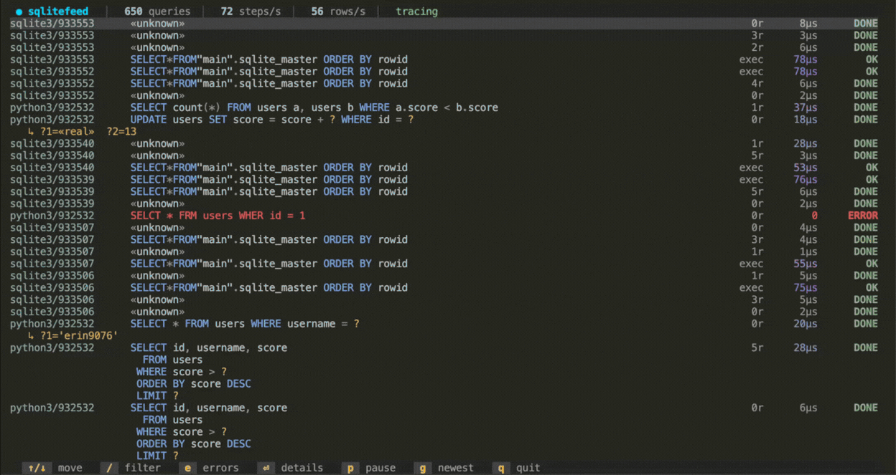

<!-- yeet:user-friendly-title: Monitor database actions -->

# `sqlitefeed`

> **Every SQL statement your app really sent SQLite, including the values it bound to the `?`s.** No query log, no `PRAGMA`, no recompile, no cooperation from the process you're watching.

<p align="center">
  <a href="#requirements"></a>
  <a href="https://yeet.cx/docs/?utm_source=github&utm_medium=readme&utm_campaign=sqlitefeed&utm_content=badge"></a>
  <a href="#how-it-works"></a>
  <a href="#license"></a>
  <a href="https://discord.gg/JxVseaAVAU"></a>
</p>

<p align="center">
  
</p>

**`sqlitefeed` is a live terminal SQLite statement monitor for Linux: it streams every statement any process on the box runs against `libsqlite3`, with the concrete bound values, per-step latency, and result code.**

## Quick start

```sh
curl -fsSL https://yeet.cx | sh   # install yeet, once
yeet run gh:yeet-src/sqlitefeed   # clone, build and run in one step
```

SQLite has no query log. It is a library linked into your process, not a server you can ask, so the usual answer is to add logging inside the application: a tracing callback, an ORM `echo` flag, a `PRAGMA` nobody remembers the name of. That works for the one app you thought to instrument, and it is useless for the background job that starts tomorrow, a `sqlite3` one-liner someone runs by hand, or the vendored binary whose source you don't have.

`sqlitefeed` attaches to the *library* instead of the app. One run watches every SQLite-backed process on the host at once, and none of them know they're being traced. Where you'd otherwise reach for `strace` and read `pread64` offsets, or bisect an ORM until it confesses what SQL it generated, you get the statement text and its bound parameters directly.

> [!TIP]
> **The bound values are the point.** A query log that shows you `WHERE score > ?` has told you almost nothing; the bug is usually in the `?`. sqlitefeed hooks `sqlite3_bind_int`, `_int64`, `_text` and `_null` alongside `prepare` and `step`, so each row carries the actual values the application substituted, correlated by the `sqlite3_stmt*` pointer.

## Contents

**Run it** — [Get started](#get-started) · [Have an agent set it up](#have-an-agent-set-it-up) · [Reading it without a TTY](#reading-it-without-a-tty)
**Understand it** — [A 60-second primer on how SQLite runs a statement](#a-60-second-primer-on-how-sqlite-runs-a-statement) · [Questions this tool answers](#questions-this-tool-answers) · [What you're looking at](#what-youre-looking-at) · [Navigation](#navigation) · [How it works](#how-it-works)
**Reference** — [Requirements](#requirements) · [What it can't see](#what-it-cant-see) · [FAQ](#faq)
**Contribute** — [Building from source](#building-from-source) · [Testing across kernels](#testing-across-kernels) · [Try it without real traffic](#try-it-without-real-traffic)

## Get started

```sh
curl -fsSL https://yeet.cx | sh
make            # clang + bpftool → bin/sqlite.bpf.o ; esbuild → the JS bundle
yeet run .      # attach to libsqlite3.so.0 and stream every statement on the host
```
[Manual install guide](https://yeet.cx/docs/manual-installation?utm_source=github&utm_medium=readme&utm_campaign=sqlitefeed) | Linux only

There is nothing to configure and there are no flags. As soon as any process on the box prepares or executes a statement, rows start landing at the top of the feed. No SQLite traffic handy? [The bundled generators](#try-it-without-real-traffic) drive `libsqlite3` for you.

It runs until you press `q` (or `Ctrl-C`), reflows when you resize the terminal, and needs a real TTY. Don't pipe or redirect it; for text output see [Reading it without a TTY](#reading-it-without-a-tty).

## Have an agent set it up

Paste this to a coding agent on the target Linux box:

```
Set up and verify github.com/yeet-src/sqlitefeed on this machine.

1. Clone it (or `git pull` if it's already here) and read AGENTS.md.
2. Install yeet if it isn't present: curl -fsSL https://yeet.cx | sh
3. Run `make`. It fetches its own clang/bpftool/esbuild, so a missing system
   toolchain is not an error.
4. Confirm libsqlite3.so.0 is on the host: `ldconfig -p | grep libsqlite3`.
   If it's missing there is nothing to attach to and the probe will fail.
5. Start traffic in a second shell: `demo/run.sh`
6. Verify from the headless probe, NOT the TUI:
   `yeet run src/probes/sqlite.js`
   Expect [PREPARE]/[BIND]/[STEP] lines within a few seconds. Ctrl-C to stop.
7. Report the first three event lines verbatim.

"It compiled" is not the same as "it works". Step 6 is the check that matters:
if no events arrive, say so rather than reporting success.
```

Prefer to drive it yourself? [Get started](#get-started) is three lines.

## A 60-second primer on how SQLite runs a statement

SQLite isn't a server. It's a C library compiled into your process, so "the database" is a function call, and there is no daemon in between holding a log you could tail.

Running one statement takes three steps, and each is a public C function that sqlitefeed hooks:

- **`sqlite3_prepare_v2(db, "SELECT … WHERE score > ?", …)`** compiles the SQL into a bytecode program and hands back a `sqlite3_stmt*` pointer. The SQL text exists *here*, at compile time, and nowhere afterwards.
- **`sqlite3_bind_int(stmt, 1, 500)`** substitutes a concrete value for each `?`. The SQL never changes; the values live beside it, which is why a query log alone can't tell you what actually ran.
- **`sqlite3_step(stmt)`** executes the bytecode. It returns `SQLITE_ROW` once per row and `SQLITE_DONE` when it's finished, so one statement usually means many `step` calls, each with its own latency.

That `sqlite3_stmt*` pointer is the thread tying it all together: prepare mints it, every bind and step names it. sqlitefeed keys on that pointer to reassemble one execution out of a dozen separate function calls.

There's a fourth path, `sqlite3_exec(db, "CREATE TABLE …", …)`, a one-shot convenience that prepares, steps and finalizes internally. It's complete on arrival, so it shows as a single `exec` row.

The catch, and the reason for [one of the trickier parts of this tool](#recovering-sql-it-never-saw-prepared): applications prepare a statement **once** and reuse the handle for hours. Attach in the middle and you'll see thousands of `step` calls on pointers whose `prepare` happened long before you arrived.

## Questions this tool answers

**My ORM is generating some query that's slow and I can't tell what it actually sends to SQLite. How do I see the real SQL?**
Run `yeet run .` and watch the feed. You get the compiled statement text as `sqlite3_prepare_v2` received it, after every layer of query-builder abstraction has had its say, plus the values bound to each placeholder. No ORM echo flag, and it works the same for Python, Go, Rust, or a binary you don't have source for.

**How do I see which SQL a process is running right now, on a box where I can't install anything or add logging to the app?**
That's the default mode. One `yeet run` attaches uprobes to the host's shared `libsqlite3`, so every process linked against it appears in the same feed, identified by the `comm/pid` gutter. Nothing is added to the traced application and nothing is restarted.

**Can I trace SQLite queries without recompiling with SQLITE_ENABLE_SQLLOG or adding a tracing callback?**
Yes, and that's the whole design. `sqlite3_trace_v2` and `SQLITE_ENABLE_SQLLOG` are compile- or app-level switches that only cover the process you configured. Uprobes hook the shared library in the kernel, so one attach covers every current and future caller.

**One of my SQLite writes is failing with a constraint error and the app just logs "database error". How do I see which statement and which values?**
Press `e` for the [errors-only view](#navigation). Failing statements render in red with their result code (`CONSTRAINT`, `UNIQUE`, `NOTNULL`, `BUSY`, …), and `sqlite3_exec` failures carry SQLite's own error text on a `✗` line. Press `Enter` on the row for the full SQL and every bound parameter, unclipped.

**Which of my SQLite statements is actually the slow one, and is it slow every time or just occasionally?**
The feed shows each execution's worst `sqlite3_step` latency, heat-colored, so the expensive ones are visually obvious as they scroll. Press `Enter` on one and the [detail overlay](#the-detail-overlay) aggregates p50/p95/p99 across every logged run of that exact SQL, with a sparkline of recent runs, which is what separates "always slow" from "slow when it contends".

**My app is fast in tests and slow in production and I suspect it's doing far more queries than I think. How do I count them?**
The title bar carries a running statement count plus live `steps/s` and `rows/s`. An N+1 pattern shows up immediately as the same SQL repeating with a different bound id on every row, which is a shape you can see in the feed long before you could infer it from a latency graph.

**Is this a replacement for Datadog, Sentry, or my APM's database monitoring?**
No. There's no retention, no query language, no alerting, and no fleet view; sqlitefeed keeps the most recent 2000 executions in memory on one host and forgets them when you quit. It's the live-debugging instrument you reach for when an APM has told you "the database is slow" and you need to see the actual statements and values. Use both.

**When should I use this instead of `strace`, an ORM's echo flag, or SQLite's own `sqlite3_trace_v2`?**
Reach for sqlitefeed when you want the SQL and its parameters from processes you didn't instrument, especially several at once. Reach for an ORM echo flag when you're in dev on one app and just want its queries in your own logs. Reach for `sqlite3_trace_v2` when you're building the app and want structured tracing shipped as a feature. `strace` sees `pread64` on a database file, which tells you SQLite did I/O but never what statement caused it. For traffic to a *networked* database, sqlitefeed is the wrong shape entirely; the wire is where you'd look, and [`redissnoop`](https://github.com/yeet-src/redissnoop) is the sibling for Redis.

## What you're looking at

```
 ● sqlitefeed  ▏  1487 queries  ▏  12 steps/s  ▏  9 rows/s  ▏  tracing
python3/34412   SELECT id, username, score FROM users WHERE score > ? ORDER BY score DESC    3r    231µs      DONE
python3/34412   INSERT OR IGNORE INTO users (username, email, age, score) VALUES (?,?,?,?)   0r    3.1ms      DONE
   ↳ ?1='alice5866'  ?2='alice5866@example.com'  ?3=27  ?4=«real»
sqlite3/34530   SELECT count(*) FROM users a, users b WHERE a.score < b.score               0r     36ms      DONE
python3/34412   INSERT INTO users (username, email) VALUES (?, ?)                            0r    412µs CONSTRAINT
   ↳ ?1='alice5866'  ?2='alice5866@example.com'
python3/34412   CREATE TABLE IF NOT EXISTS sessions (id INTEGER PRIMARY KEY, …)            exec   1.8ms      DONE
```

Three regions. The **title bar** carries the running totals and the probe status. The **feed** fills the body, newest statement at the top. The **footer** shows the key hints, or the live filter prompt while you're typing one.

Each statement is one block: the process and pid in the left gutter, the SQL flexing in the middle (one terminal row per source line, so multi-line SQL keeps its shape), and three right-pinned columns. A dim `↳` line lists the bound parameters when there are any, and a red `✗` line carries SQLite's error text when an `exec` fails.

| column | meaning |
| --- | --- |
| `comm/pid` | the process that ran it, so several apps in one feed stay distinguishable. Blank on continuation lines of multi-line SQL |
| SQL | the statement as `sqlite3_prepare_v2` received it, syntax-highlighted. `«unknown»` when the statement was prepared before sqlitefeed attached and [couldn't be recovered](#recovering-sql-it-never-saw-prepared) |
| `↳` params | the concrete bound values, `?1`-indexed. Text is quoted and clipped to 24 chars; press `Enter` for the full values |
| rows | rows this execution returned (`step` calls that came back `SQLITE_ROW`). `exec` instead of a count for a one-shot `sqlite3_exec` |
| latency | the **worst** single `sqlite3_step` in this execution, not the total. Heat-colored on a log scale, roughly 10µs cool to 100ms white-hot |
| result | the final result code. `OK`/`ROW`/`DONE` are the normal path in green; anything else turns the whole row red |

Each row freezes the moment its execution completes and never mutates again, so a burst scrolls past as a stable log rather than a flickering aggregate. Re-running the same cached statement produces a *new* row rather than updating the old one, which is what makes an N+1 pattern visible as repetition.

The SQL is colored by a small tokenizer ([`lib/sqlhl.js`](src/lib/sqlhl.js)) on the same 256-color palette as the rest of the UI: keywords in cornflower blue, identifiers near-white, string literals green, numbers gold, `?`/`:name` placeholders amber, comments and punctuation grey. An errored statement drops the highlighting and renders uniformly red, so it reads as one broken thing rather than a colorful one.

## Navigation

The feed follows the newest statement by default. Move the cursor off the top row and the view **holds**: it keeps showing the snapshot you're reading while statements keep arriving underneath, and the title bar shows `⏸ HOLD`. Press `g` to jump back to the newest and resume following.

| key | action |
| --- | --- |
| `↑`/`↓`, `j`/`k` | move the cursor (holds the view once you leave the newest row) |
| `PgUp`/`PgDn` | move ten rows; the mouse wheel moves three |
| `Enter` | open the [detail overlay](#the-detail-overlay) for the selected statement |
| `e` | errors-only view; press again for everything |
| `/` | fuzzy filter, matching process, SQL, and bound values at once |
| `p` | pause. Unlike `HOLD`, this survives jumping back to the top |
| `g` | jump to newest and resume following |
| `q` / `Esc` | quit (`Esc` closes the overlay or clears the filter first) |

The filter is a subsequence match, so `stusr` finds `SELECT * FROM users`, and the matched characters are highlighted in place. Because the haystack includes bound values, `alice5866` finds every statement that touched that row regardless of which query it was.

### The detail overlay

`Enter` opens a modal view of one statement that the feed has to clip and it doesn't:

- **The full SQL**, wrapped rather than ellipsized, with the syntax highlighting intact.
- **Every bound parameter** in full, with its type, unclipped.
- **This execution**: rows, step count, selectivity (what fraction of steps returned a row), worst step, average step, and total time.
- **Across every run of this SQL**: the processes that ran it, an error count, p50/p95/p99/max step latency, and a sparkline of the most recent 48 runs, oldest to newest.

The statement you opened is a frozen snapshot and never changes under you, but the cross-run panel reads the live log, so a hot query's percentiles keep moving while you watch. `Esc` or `Enter` returns to the feed.

## Reading it without a TTY

A TUI is unreadable to an agent, a CI job, or an SSH session in a hurry. The data layer runs standalone and prints plain text:

```sh
yeet run src/probes/sqlite.js
```

It attaches the same probes and prints one line per raw event until you `Ctrl-C` it:

```
[sqlite] attached 11 probes on libsqlite3.so.0 — waiting…
[PREPARE] python3/34412 stmt=0x7f2a1c0a4e28 rc=0 sql="SELECT id, username FROM users WHERE score > ?"
[BIND] python3/34412 stmt=0x7f2a1c0a4e28 bind #1 = "500"
[STEP] python3/34412 stmt=0x7f2a1c0a4e28 rc=100 latency=231000ns
```

This is the raw event stream, before the correlation the TUI does, so you see each `prepare`/`bind`/`step` separately rather than assembled into one row per execution. That makes it the right thing for verifying the probe works (it's step 6 of [the agent prompt](#have-an-agent-set-it-up)) and for piping somewhere, and the wrong thing for reading a busy system by eye.

There is no `--json` mode. The `RingBuf.subscribe` callback in [`src/probes/sqlite.js`](src/probes/sqlite.js) holds every decoded record, so a JSON, HTTP, or Kafka sink is a branch there rather than a rewrite.

## How it works

Three directories, one rule each: [`src/probes/`](src/probes/) is the only BPF-aware code, [`src/components/`](src/components/) is pure presentation, [`src/lib/`](src/lib/) is pure helpers. They're composed in `main.jsx` through the `@/` source alias.

```
src/
├── main.jsx                    composition root: view state, keyboard + wheel input, mount
├── probes/sqlite.js            the only BPF-aware module — load, attach, fold events into a log
├── components/
│   ├── titlebar.jsx            totals, steps/s, rows/s, probe status, hold/pause marker
│   ├── statements.jsx          the feed: highlighted, height-budgeted, variable-height rows
│   ├── detail.jsx              the Enter overlay: full SQL, all params, cross-run percentiles
│   └── footer.jsx              key hints and the live filter prompt
└── lib/
    ├── sqlhl.js                SQL tokenizer → colored spans
    ├── format.js               rates, durations, latency heat ramp, result-code names
    └── fuzzy.js                subsequence match + matched-column positions
```

### The BPF side

[`src/bpf/sqlite.bpf.c`](src/bpf/sqlite.bpf.c) carries eleven programs. A generic `SEC("uprobe")`/`SEC("uretprobe")` names no target; `probes/sqlite.js` binds each to a concrete symbol in `libsqlite3.so.0` at `attach()` time, resolved by bare name through the linker cache.

| program | attached to | what it captures |
| --- | --- | --- |
| `prepare_entry` / `_return` | `sqlite3_prepare_v2` | the SQL text, the compile result code, and the new `stmt` pointer (an out-param, known only on return) |
| `step_entry` / `_return` | `sqlite3_step` | per-call latency and result code; entry also triggers `zSql` recovery |
| `exec_entry` / `_return` | `sqlite3_exec` | one-shot statements: SQL, total latency, result code, and the error string on failure |
| `bind_int`, `_int64`, `_text`, `_null`, `_double` | `sqlite3_bind_*` | the concrete value bound to each `?`. Entry-only, no return needed |

Five maps connect kernel to userspace:

- **`sql_events`** (`RINGBUF`, 512 KB) carries one `sqlite_event` per prepare, bind, step, or exec.
- **`known`** (`LRU_HASH`, 65536) holds statement pointers whose SQL has already been emitted, gating recovery to once each. LRU so it self-bounds over a long session.
- **`prepare_scratch`**, **`step_scratch`**, **`exec_scratch`** (`HASH`, 8192 each) pair each entry probe with its return: the entry stashes arguments and a timestamp keyed by `pid_tgid`, the return reads and deletes them.

Everything ties together through the `sqlite3_stmt*` pointer, which the kernel treats as an opaque per-statement id. The kernel deliberately does no correlation: it emits flat events and userspace assembles them.

<details>
<summary><strong>Why one scratch slot per thread rather than a nesting stack</strong></summary>

Each of `prepare_scratch`, `step_scratch` and `exec_scratch` holds exactly one entry per thread, so a nested call on the same thread clobbers the outer one and that statement is missed, showing as `«unknown»` when it's later stepped. SQLite does make nested calls (reparsing `sqlite_master` mid-DDL, for instance), so this is a real failure mode, and it is the deliberate choice.

The apparently more correct alternative is a depth-counting stack. It's worse in practice. Uretprobes are silently dropped past the kernel's `maxactive` limit under rapid or nested calls, so pushes outnumber pops, the depth drifts, and every subsequent statement reads a stale frame. A missed pairing with one slot costs one statement and **self-corrects on the next top-level call**; a drifting stack corrupts everything after it, permanently.

</details>

### Recovering SQL it never saw prepared

A long-running process prepares its statements once and reuses the cached handles for hours. Attach after that and every `step` you see belongs to a statement whose `prepare` already happened, leaving you a bare pointer and no SQL.

sqlitefeed recovers it. `sqlite3_sql(stmt)` is essentially `return ((Vdbe*)stmt)->zSql`, which compiles to a single `mov OFFSET(%rdi),%rax`. At build time [`build/find-zsql-offset.sh`](build/find-zsql-offset.sh) disassembles that one function in the host's `libsqlite3`, reads the offset straight out of the instruction, and bakes it in as `-DZSQL_OFFSET=…`. No DWARF, no per-version offset table. On the first `step` or `bind` of an unknown statement the probe reads `Vdbe.zSql` at that offset and emits a synthetic `PREPARE`, so a cached statement lights up with its real SQL and correlates identically to one that was watched compiling.

The `known` LRU map gates this to once per statement. Recovery is **x86-64 only**; on other architectures, or when the library can't be located, the offset is `0`, recovery is compiled out, and unseen statements show `«unknown»` until they re-prepare.

### The JS side

`probes/sqlite.js` folds the flat event stream into an append-only **log of completed executions**, not a mutable per-statement aggregate. A statement is assembled in flight (`prepare` → `bind*` → `step*`) in a map keyed by the `stmt` pointer, then frozen into the log the instant it finishes. That's why a row already on screen never changes or jumps, and why re-running a cached statement appends rather than updates.

Getting that boundary right is most of the userspace logic. A `bind` arriving on a statement that has already stepped means a reset-and-rerun, so the previous execution is finalized and a new one starts against the same remembered SQL. A statement that stepped but never reached a terminal code, because it was superseded by a reset mid-fetch, is recorded as `DONE` rather than showing its stale initial `OK`.

A 250 ms window timer publishes one snapshot per frame, so a busy ring buffer costs one re-render rather than thousands, and the log is capped at 2000 executions. Everything downstream is pure: the components read the `statements`, `stats` and `status` signals and nothing else.

### Why uprobes on `libsqlite3`, not a query log

A query log lives inside one application. It's compiled in or configured per process, which means it covers the processes you thought about in advance and nothing else: not the cron job added next quarter, not the `sqlite3` shell someone runs by hand, not the vendored binary.

The public C API is the seam where *every* application hands SQL to the engine, and it's stable across SQLite versions in a way internal symbols are not. Hooking it with uprobes puts the instrumentation in the kernel rather than the process, so one attach covers every current and future caller of the shared library with no per-app setup and no restarts. Pairing entry with return probes is what buys the two things a log can't easily give you: real per-call latency, and the out-param `stmt` pointer that ties a statement's whole life together.

The cost of that seam is that it's a *library* boundary, not a file one. Anything that doesn't go through the shared `libsqlite3.so.0` is invisible, which is the first entry in [what it can't see](#what-it-cant-see).

## Requirements

> [!IMPORTANT]
> - **A Linux kernel with BTF** (`CONFIG_DEBUG_INFO_BTF=y`), which `bpftool` uses to generate `src/bpf/include/vmlinux.h`. Default on current Arch, Fedora, Ubuntu and Debian. Uprobes and ring buffers put the practical floor around 5.8.
> - **`libsqlite3.so.0` on the host.** This is the uprobe target, resolved by bare name through the linker cache. Check with `ldconfig -p | grep libsqlite3`.
> - **The yeet daemon**, which performs the privileged BPF load so `sqlitefeed` itself runs unprivileged. `curl -fsSL https://yeet.cx | sh` installs it. `yeet run` never needs `sudo`.
> - **x86-64** for [SQL recovery](#recovering-sql-it-never-saw-prepared) specifically. Everything else works anywhere; recovery quietly disables itself elsewhere.
>
> Building from source additionally needs nothing you don't already have: clang, bpftool and esbuild are fetched as a static toolchain, and there's no node or npm involved.

## What it can't see

> [!NOTE]
> sqlitefeed observes; it does not enforce. It shows you what ran, after it ran. It cannot block, delay, rewrite, or roll back a statement.

- **Statically linked SQLite is invisible.** Plenty of programs bundle their own copy of SQLite rather than linking the shared library, including some language runtimes and most single-binary Go and Rust tools. There is no `libsqlite3.so.0` in the process to attach to, so those statements never appear. If your app is missing from the feed, check `ldd` on it first.
- **`REAL` bind values arrive as a type, not a value.** A bound double is passed in an SSE register (`xmm0`) that isn't part of `pt_regs`, so a uprobe can't read it. The row shows `«real»`. Integers, text and NULLs are captured in full.
- **Blobs aren't captured.** `sqlite3_bind_blob` isn't hooked, so a blob parameter simply doesn't appear on the `↳` line. That's a deliberate omission rather than a limitation: blob payloads are arbitrary binary of arbitrary size and don't belong in a scrolling terminal feed.
- **SQL and text values are capped at 512 bytes**, NUL-terminated, so a very long statement or a large text parameter is truncated at the kernel boundary before it ever reaches userspace.
- **Nested calls on one thread lose the outer statement**, shown as `«unknown»`. It self-corrects on the next top-level call, and the [reasoning for that trade](#the-bpf-side) is in the details block above.
- **No retention and no aggregation across hosts.** The log holds the most recent 2000 executions in memory on one machine and is gone when you quit. There's no persistence, no query language, no alerting, and no fleet view.
- **Rows are dropped rather than queued under extreme load.** Every `step` and `exec` event carries its SQL text, so a process running tens of thousands of statements a second can outrun the 512 KB ring buffer. It drops, which keeps the traced application at full speed rather than blocking it.
- **Other databases need other tools.** This is SQLite specifically, hooked at a library boundary that doesn't generalize. For Redis reach for [`redissnoop`](https://github.com/yeet-src/redissnoop), and for a database reached over a socket the traffic is on the wire, where [`pktscope`](https://github.com/yeet-src/pktscope) reads it.

## FAQ

**Does it slow the traced application down?**
Not measurably. The probes are passive and the cost is a bounded ring-buffer write per call, on a code path that was already doing a database operation. Under backpressure the buffer drops rather than blocking, so the traced app never waits on sqlitefeed.

**Will it show statements from a process that was already running when I start it?**
Yes, on x86-64. That's what [`zSql` recovery](#recovering-sql-it-never-saw-prepared) exists for: statements prepared and cached before you attached are recovered from the statement struct on their next `step` or `bind`.

**Everything shows as `«unknown»`. What's wrong?**
Recovery is disabled, which means either you're not on x86-64 or `find-zsql-offset.sh` couldn't locate `libsqlite3` at build time (it needs `objdump` and `nm`). Statements re-prepared after you attach still show their SQL, so a restart of the traced app gives you a full feed either way.

**Can it tell me which database file a statement ran against?**
No. The probes key on the `sqlite3_stmt*` pointer, not the `sqlite3*` connection, and the filename lives on the connection. A process with several open databases shows all of them in one undifferentiated stream.

**Does it work inside containers?**
Yes, from the host. The uprobe attaches to the host's `libsqlite3.so.0`, so it covers any container process that uses the host's shared library. A container carrying its own copy in its image isn't covered by that attach, because it's a different file on disk.

## Building from source

```sh
make          # clang + bpftool → bin/sqlite.bpf.o ; esbuild → src/index.jsx
make bpf      # just the BPF object
make bundle   # just the JS bundle
make clean    # remove build artifacts
```

`make` runs two independent compilers that know nothing about each other. **clang and bpftool** compile `src/bpf/sqlite.bpf.c` into the loadable object `bin/sqlite.bpf.o`, with the `zSql` offset discovered and baked in as a `-D` define. **esbuild** bundles `src/main.jsx` into `src/index.jsx`, resolving the `@/` (source root) and `#/` (project root) aliases through tsconfig `paths` and leaving `yeet:*` builtins external.

Both come from a version-pinned static toolchain fetched into a per-machine cache, so the build needs no system clang, no bpftool, and no node or npm. The generated `vmlinux.h`, `src/index.jsx` and `bin/*.bpf.o` are build artifacts and are gitignored.

One thing that surprises everyone once: those aliases are **bundle-time only**. Nothing rewrites them at runtime, which is why the probe locates its BPF object with `import.meta.dirname` and a relative path rather than an alias, and why that path differs depending on whether you run the bundle or the probe module directly.

## Testing across kernels

A BPF program that loads on your laptop can be rejected by an older kernel's verifier. That's the failure this guards against.

`make veristat` loads `bin/sqlite.bpf.o` with veristat on **your** kernel, confirming every program passes the verifier and reporting per-program complexity (instructions and states). Loading BPF is privileged, so run it with `sudo`.

For everything else, [`.github/workflows/kernel-matrix.yml`](.github/workflows/kernel-matrix.yml) builds the object once per kernel in its matrix, boots that kernel in a VM ([cilium's little-vm-helper](https://github.com/cilium/little-vm-helper), images from `quay.io/lvh-images`), and runs the vendored static veristat inside it, failing the job if any program is rejected. The in-VM gate is `build/verify-kernel.sh`.

Run the same matrix locally on Linux with KVM using `make veristat-matrix`, which prints an `ok`/`FAIL` grid. Pick specific kernels with `make veristat-matrix KERNELS="6.6-main bpf-next-main"`.

## Try it without real traffic

An empty feed and a broken feed look identical, so verify with traffic you control. [`demo/run.sh`](demo/run.sh) owns the whole demo:

```sh
# terminal 1
yeet run .

# terminal 2
demo/run.sh
```

It runs a Python workload in the foreground and, in the background, a trickle of `sqlite3`-CLI queries against the same database, so the process gutter shows both `python3` and `sqlite3`. Don't start `traffic.py` separately as well; `run.sh` already runs it.

The workload is built to exercise every rendering path: `executescript` DDL for the `exec` row, parameterized inserts covering int, text, NULL and `«real»` binds, a multi-line `SELECT`, a deliberately slow self-join for the latency heat, and six distinct failures covering `ERROR`, `CONSTRAINT` and `MISMATCH` result codes. The database is a temp file (`/tmp/sqlitefeed_demo.db` by default, overridable as the first argument) in WAL mode; delete it any time to start fresh.

For just the Python side, `python3 demo/traffic.py` loops until `Ctrl-C`, `--once` runs a single round, and `--interval` and `--db` are available. See [`demo/README.md`](demo/README.md).

## License

Dual BSD/GPL.

---

Built with [yeet](https://yeet.cx/docs/?utm_source=github&utm_medium=readme&utm_campaign=sqlitefeed&utm_content=footer), a JS runtime for writing eBPF programs on Linux machines. Join us on [discord](https://discord.gg/JxVseaAVAU).
